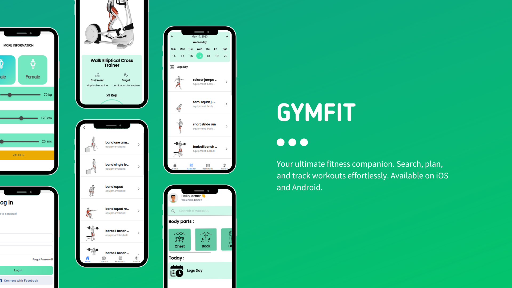
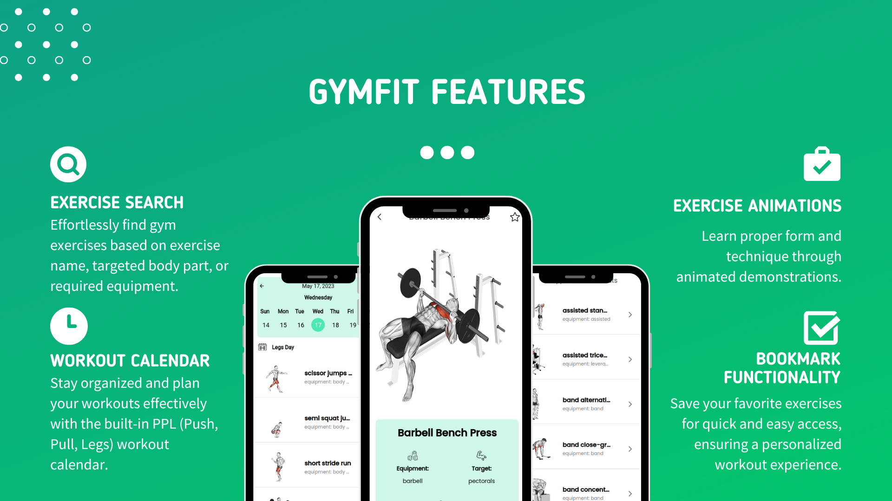
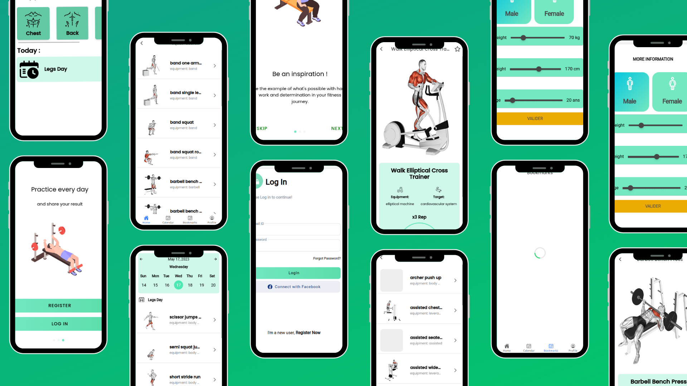

  <h1>GymFit Mobile App</h1>

  <h2>Description</h2>
  
  
GymFit is a cross-platform mobile application designed to assist users in their fitness journey. The app offers a comprehensive range of features, including exercise search, workout program planning, bookmarking, and login functionality. Developed using Ionic Angular framework and integrated with the ExerciseDb API and Firebase for authentication, GymFit provides a seamless and user-friendly experience for fitness enthusiasts.

  <h2>Features</h2>
  
<ol>
  <li><strong>Login Service with Firebase:</strong> GymFit utilizes Firebase authentication to facilitate secure user login and provide personalized experiences.</li>
  <li><strong>Exercise Search:</strong> Users can search for gym exercises using various criteria, such as exercise name, body part targeted, or equipment required. This feature allows users to easily find exercises that suit their specific fitness goals.</li>
  <li><strong>PPL Workout Calendar:</strong> GymFit provides a pre-built calendar featuring the popular PPL (Push, Pull, Legs) workout program. Users can refer to the calendar to track their progress and plan their workout routines effectively.</li>
  <li><strong>Bookmark Functionality:</strong> GymFit allows users to bookmark exercises of interest. This feature enables users to save exercises and access them later for quick reference, ensuring a seamless workout experience.</li>
  <li><strong>Integration with ExerciseDb API:</strong> GymFit is integrated with the ExerciseDb API, which provides a vast database of exercises. This integration enhances the app's functionality by offering a wide range of exercises for users to explore.</li>
  <li><strong>Animated Exercise Demonstrations:</strong> Gain better understanding of exercise techniques and form through interactive and animated exercise demonstrations, ensuring effective and safe workouts.</li>
</ol>

  <h2>How to Download and Install</h2>
  <ol>
    <li><strong>Android & IOS:</strong> The GymFit mobile app can be downloaded and installed on Android and IOS.</li>
    <li><strong>Local Machine:</strong> To clone and run the app on your local machine, follow these steps:
      <ol>
        <li>Clone the repository: <code>git clone https://github.com/OmarMAARAF/gym-fit</code></li>
        <li>Install dependencies: <code>npm install --force</code></li>
        <li>Run the app locally: <code>ionic serve</code></li>
        <li>Access the app in your browser at <code>http://localhost:8100</code></li>
      </ol>
    </li>
  </ol>

<h2>walkthrough & Screnshots</h2>
 
 
Start your fitness journey with GymFit and enjoy a convenient and feature-rich mobile app to support your workouts!

</body>
</html>
